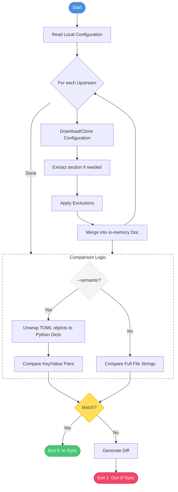

<p align="center">
  
  <br>
  <a href="https://pypi.org/project/ruff-sync/"></a>
  <a href="https://codecov.io/gh/Kilo59/ruff-sync"></a>
  <a href="https://results.pre-commit.ci/latest/github/Kilo59/ruff-sync/main"></a>
  <a href="https://github.com/astral-sh/ruff"></a>
  <a href="https://wily.readthedocs.io/"></a>
</p>

# ruff-sync

**Keep your Ruff config consistent across multiple projects.**

`ruff-sync` is a CLI tool that pulls a canonical [Ruff](https://docs.astral.sh/ruff/) configuration from an upstream `pyproject.toml` or `ruff.toml` (hosted anywhere — GitHub, GitLab, or any raw URL) and merges it into your local project, preserving your comments, formatting, and project-specific overrides.

---

## Table of Contents

- [The Problem](#the-problem)
- [How It Works](#how-it-works)
- [Quick Start](#quick-start)
- [Key Features](#key-features)
- [Configuration](#configuration)
- [Pre-commit Integration](#pre-commit-integration)
- [CI Integration](#ci-integration)
- [Example Workflow](#example-workflow)
- [Detailed Check Logic](#detailed-check-logic)
- [Dogfooding](#dogfooding)
- [License](#license)

## The Problem

If you maintain more than one Python project, you've probably copy-pasted your `[tool.ruff]` config between repos more than once. When you decide to enable a new rule or bump your target Python version, you get to do it again — in _every_ repo. Configs drift, standards diverge, and your "shared" style guide becomes a polite suggestion.

### How Other Ecosystems Solve This

| Ecosystem | Mechanism | Limitation for Ruff users |
|-----------|-----------|---------------------------|
| **ESLint** | [Shareable configs](https://eslint.org/docs/latest/extend/shareable-configs) — publish an npm package, then `extends: ["my-org-config"]` | Requires a package registry (npm). Python doesn't have an equivalent convention. |
| **Prettier** | [Shared configs](https://prettier.io/docs/sharing-configurations) — same npm-package pattern, referenced via `"prettier": "@my-org/prettier-config"` in `package.json` | Same — tightly coupled to npm. |
| **Ruff** | [`extend`](https://docs.astral.sh/ruff/configuration/#config-file-discovery) — extend from a _local_ file path (great for monorepos) | Only supports local paths. No native remote URL support ([requested in astral-sh/ruff#12352](https://github.com/astral-sh/ruff/issues/12352)). |

Ruff's `extend` is perfect inside a monorepo, but if your projects live in **separate repositories**, there's no built-in way to inherit config from a central source.

**That's what `ruff-sync` does.**

### How It Works

```
┌─────────────────────────────┐
│  Upstream repo              │
│  (your "source of truth")   │
│                             │
│  pyproject.toml             │
│    [tool.ruff]              │
│    target-version = "py310" │
│    lint.select = [...]      │
└──────────┬──────────────────┘
           │  ruff-sync downloads
           │  & extracts [tool.ruff]
           ▼
┌─────────────────────────────┐
│  Your local project         │
│                             │
│  pyproject.toml             │
│    [tool.ruff]  ◄── merged  │
│    # your comments kept ✓   │
│    # formatting kept ✓      │
│    # per-file-ignores kept ✓│
└─────────────────────────────┘
```

1. You point `ruff-sync` at the URL of your canonical configuration (repository, directory, or direct file).
2. It downloads the file and extracts the configuration (from `[tool.ruff]` in `pyproject.toml` or the top-level in `ruff.toml`).
3. It **merges** the upstream config into your local project — updating values that changed, adding new rules, but preserving your local comments, whitespace, and any sections you've chosen to exclude (like `per-file-ignores`).

No package registry. No publishing step. Just a URL.

## Quick Start

### Install

With [uv](https://docs.astral.sh/uv/) (recommended):

```console
uv tool install ruff-sync
```

With [pipx](https://pipx.pypa.io/stable/):

```console
pipx install ruff-sync
```

With [pip](https://pip.pypa.io/en/stable/):

```console
pip install ruff-sync
```

### Usage

```console
# Sync from a GitHub/GitLab repository (root or specific directory)
ruff-sync https://github.com/my-org/standards
ruff-sync https://github.com/my-org/standards/tree/main/configs/shared

# Or a direct blob/file URL (auto-converts to raw)
ruff-sync https://github.com/my-org/standards/blob/main/pyproject.toml

# Clone from any git repository (using SSH or HTTP, defaults to --depth 1)
# You can use the --branch flag to specify a branch (default: main)
ruff-sync git@github.com:my-org/standards.git
ruff-sync ssh://git@gitlab.com/my-org/standards.git

# Or if configured in pyproject.toml (see Configuration), simply run:
ruff-sync

# Exclude specific sections from being overwritten using dotted paths
ruff-sync --exclude lint.per-file-ignores lint.ignore

# Check if your local config is in sync (useful in CI)
ruff-sync check https://github.com/my-org/standards

# Semantic check — ignore cosmetic differences like comments and whitespace
ruff-sync check --semantic
```

Run `ruff-sync --help` for full details on all available options.

## Key Features

- 🏗️ **Format-preserving merges** — Uses [tomlkit](https://github.com/sdispater/tomlkit) under the hood, so your comments, whitespace, and TOML structure are preserved. No reformatting surprises.
- 📂 **Upstream Layers** — Merge configurations from several sources sequentially (e.g., base company config + team-specific overrides).
- 🌐 **GitHub & GitLab URL support** — Automatically converts GitHub/GitLab repository URLs, tree (directory) URLs, or blob (file) URLs to raw content URLs.
- 🔍 **Smart configuration discovery** — Point at a directory and `ruff-sync` will automatically find your config. It checks `pyproject.toml`, `ruff.toml`, and `.ruff.toml` (in that order).
- 📥 **Git clone support** — If the URL starts with `git@` or uses the `ssh://`, `git://`, or `git+ssh://` schemes, `ruff-sync` will perform an efficient shallow clone (using `--filter=blob:none` and `--no-checkout`) to safely extract the configuration with minimal network traffic.
- 🛡️ **Selective exclusions** — Keep project-specific overrides (like `per-file-ignores` or `target-version`) from being clobbered by the upstream config.
- 🌍 **Works with any host** — GitHub, GitLab, Bitbucket, private SSH servers, or any raw URL that serves a `pyproject.toml` or `ruff.toml`.
- 🤖 **CI-ready `check` command** — Verify that your local config is in sync without modifying anything. Exits 1 if out of sync, making it perfect for pre-merge gates. ([See detailed logic](#detailed-check-logic))
- 🧠 **Semantic mode** — Use `--semantic` to ignore cosmetic differences (comments, whitespace) and only fail on real value changes.

## Configuration

You can configure `ruff-sync` itself in your `pyproject.toml`:

```toml
[tool.ruff-sync]
# The source of truth for your Ruff configuration
upstream = "https://github.com/my-org/standards"

# Use simple names for top-level keys, and dotted paths for nested keys
exclude = [
    "target-version",                      # Top-level [tool.ruff] key — projects target different Python versions
    "lint.per-file-ignores",                # Project-specific file overrides
    "lint.ignore",                         # Project-specific rule suppressions
    "lint.isort.known-first-party",         # Every project has different first-party packages
    "lint.flake8-tidy-imports.banned-api",  # Entire plugin section — project-specific banned APIs
    "lint.pydocstyle.convention",          # Teams may disagree on google vs numpy vs pep257
]
```

This sets the default upstream and exclusions so you don't need to pass them on the command line every time.
_Note: Any explicitly provided CLI arguments will override the values in `pyproject.toml`._

### Advanced Configuration

Here are all the possible values that can be provided in `[tool.ruff-sync]` along with their explanations and defaults:

```toml
[tool.ruff-sync]
# The source of truth URL(s) for your Ruff configuration. (Required, unless passed via CLI)
# Accepts a single string URL or a list of URLs.
upstream = ["https://github.com/my-org/standards", "https://github.com/my-org/team-tweaks"]

# A list of config keys to exclude from being synced. (Default: ["lint.per-file-ignores"])
# Use simple names for top-level keys, and dotted paths for nested keys.
exclude = [
    "target-version",
    "lint.per-file-ignores",
]

# The branch, tag, or commit hash to use when resolving a Git repository URL. (Default: "main")
branch = "develop"

# A directory prefix to use when looking for a configuration file in a repository. (Default: "")
# Useful if the upstream config is not at the repository root.
path = "config/ruff"

# The local target directory or file to sync into. (Default: ".")
to = "."
```

## Pre-commit Integration

Ensure your configuration is always in sync before every commit. Add this to your `.pre-commit-config.yaml`:

```yaml
- repo: https://github.com/Kilo59/ruff-sync
  rev: v0.1.0  # Use the latest version
  hooks:
    - id: ruff-sync-check
```

See the [Pre-commit Guide](https://kilo59.github.io/ruff-sync/pre-commit/) for more details.

## CI Integration

The `check` command is designed for use in CI pipelines. Add it as a step to catch config drift before it merges:

```yaml
# .github/workflows/ci.yaml
- name: Check ruff config is in sync
  run: |
    ruff-sync check --semantic
```

With `--semantic`, minor reformatting of your local file won't cause a false positive — only actual rule or value differences will fail the check.

To see exactly what's drifted, omit `--no-diff` (the default) and the output will include a unified diff:

```console
$ ruff-sync check --semantic
🔍 Checking Ruff sync status...
❌ Ruff configuration at pyproject.toml is out of sync!
--- local (semantic)
+++ upstream (semantic)
@@ -5,6 +5,7 @@
   "select": [
+    "PERF",
     "RUF",
     ...
   ]
```

## Example Workflow

A typical setup for an organization:

1. **Create a "standards" repo** with your canonical `pyproject.toml` containing your shared `[tool.ruff]` config.
2. **In each project**, run `ruff-sync` pointing at that repo — either manually, in a Makefile, or as a CI step.
3. **When you update the standard**, re-run `ruff-sync` in each project to pull the changes. Your local comments and `per-file-ignores` stay intact.

```console
# In each project repo:
ruff-sync https://github.com/my-org/python-standards
git diff pyproject.toml  # review the changes
git commit -am "sync ruff config from upstream"
```

### Curated Examples

While `ruff-sync` is designed to sync from _any_ repository or URL of your choosing, this repository also provides a few curated configurations in the [`configs/`](./configs/) directory that you can use directly.

`ruff-sync` is flexible with URLs. You can point it at a repository root, a specific directory (tree), a direct file (blob), or even a raw content URL.

#### Kitchen Sink

An exhaustive configuration that explicitly enables and documents almost all available Ruff rules. Great for establishing a strict baseline.

```console
# Directory URL (recommended)
ruff-sync https://github.com/Kilo59/ruff-sync/tree/main/configs/kitchen-sink

# Direct file URL (blob)
ruff-sync https://github.com/Kilo59/ruff-sync/blob/main/configs/kitchen-sink/ruff.toml

# Raw content URL
ruff-sync https://raw.githubusercontent.com/Kilo59/ruff-sync/main/configs/kitchen-sink/ruff.toml

# Git SSH URL (clones the repo)
ruff-sync git@github.com:Kilo59/ruff-sync.git --path configs/kitchen-sink
```

#### FastAPI & Async

Tailored for modern web applications. Includes rules for `asyncio`, security (`flake8-bandit`), and Pydantic-friendly naming conventions.

```console
# Repository Root (if the config is at the root)
ruff-sync https://github.com/my-org/fastapi-standards

# Directory URL
ruff-sync https://github.com/Kilo59/ruff-sync/tree/main/configs/fastapi
```

#### Default Syncing

Set your preferred standard as the default in your `pyproject.toml`:

```toml
[tool.ruff-sync]
upstream = "https://github.com/Kilo59/ruff-sync"
path = "configs/fastapi"
```

## Bootstrapping a New Project

By default, `ruff-sync` requires an existing configuration file (`pyproject.toml` or `ruff.toml`) to merge into. If you are starting a fresh project and want to initialize it with your organization's Ruff settings, you can use the `--init` flag to scaffold a new file automatically.

```console
# Create a new pyproject.toml (or ruff.toml) pre-configured with upstream settings
ruff-sync pull https://github.com/my-org/standards --init
```

`ruff-sync` seamlessly supports both `pyproject.toml` and standalone `ruff.toml` (or `.ruff.toml`) files. If your local target is a directory, it will look for configuration files in the following order: `ruff.toml` -> `.ruff.toml` -> `pyproject.toml`. If your upstream source or your local target is a `ruff.toml`, it will automatically adapt and sync the root configuration rather than looking for a `[tool.ruff]` section.

## Detailed Check Logic

When you run `ruff-sync check`, it follows this process to determine if your project has drifted from the upstream source:



## Dogfooding

To see `ruff-sync` in action, you can ["dogfood" it on this project's own config](./scripts).

[**Check if this project is in sync with its upstream:**](./scripts/check_dogfood.sh)

```console
./scripts/check_dogfood.sh
```

[**Or sync from a large upstream like Pydantic's config:**](./scripts/pull_dogfood.sh)

```console
# Using a HTTP URL
./scripts/pull_dogfood.sh
# Using a Git URL
./scripts/gitclone_dogfood.sh
```

This will download Pydantic's Ruff configuration and merge it into the local `pyproject.toml`. You can then use `git diff` to see how it merged the keys while preserving the existing structure and comments.

**To revert the changes after testing:**

```console
git checkout pyproject.toml
```

## License

[MIT](LICENSE.md)
