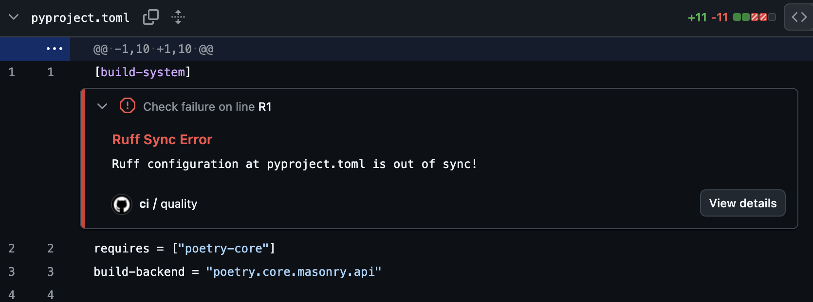

# CI Integration

`ruff-sync` is designed to be run in CI pipelines to ensure that all repositories in an organization stay in sync with the central standards.

## Usage in CI

The best way to use `ruff-sync` in CI is with the `check` command. If the configuration has drifted, `ruff-sync check` will exit with a non-zero code, failing the build.

### GitHub Actions

We recommend using `uv` to run `ruff-sync` in GitHub Actions.

#### Basic Check

```yaml
name: "Standards Check"

on:
  pull_request:
    branches: [main]

jobs:
  ruff-sync:
    runs-on: ubuntu-latest
    steps:
      - uses: actions/checkout@v4
      - uses: astral-sh/setup-uv@v5
      - name: Check Ruff Config
        run: uvx ruff-sync check --semantic --output-format github
```

By using `--output-format github`, `ruff-sync` will emit special workflow commands that GitHub translates into inline annotations directly on your Pull Request's file diff.



### SARIF Upload (GitHub Advanced Security)

For repositories with [GitHub Advanced Security](https://docs.github.com/en/get-started/learning-about-github/about-github-advanced-security) enabled, upload SARIF results to track drift findings in the **Security tab** and get per-key inline PR annotations:

```yaml
- name: Check Ruff config (SARIF)
  run: ruff-sync check --output-format sarif > ruff-sync.sarif || true

- name: Upload SARIF results
  uses: github/codeql-action/upload-sarif@v3
  with:
    sarif_file: ruff-sync.sarif
    category: ruff-sync
```

The `|| true` ensures the upload step always runs even when drift is detected (exit code 1).

> **Why SARIF over `--output-format github`?** The `github` format creates ephemeral PR annotations that disappear after the check re-runs. SARIF findings are persisted in the Security tab, tracked as "introduced" and "resolved" across branches, and each drifted TOML key (`lint.select`, `target-version`, etc.) appears as a separate, deduplicated finding.

### Automated Sync PRs

Instead of just checking, you can have a bot automatically open a PR when the upstream configuration changes.

```yaml
name: "Upstream Sync"

on:
  schedule:
    - cron: '0 0 * * 1' # Every Monday at midnight
  workflow_dispatch:

jobs:
  sync:
    runs-on: ubuntu-latest
    steps:
      - uses: actions/checkout@v4
      - uses: astral-sh/setup-uv@v5
      - name: Pull upstream
        run: uvx ruff-sync
      - name: Create Pull Request
        uses: peter-evans/create-pull-request@v6
        with:
          commit-message: "chore: sync ruff configuration from upstream"
          title: "chore: sync ruff configuration"
          body: "This PR synchronizes the Ruff configuration with the upstream source."
          branch: "ruff-sync-update"
```

### GitLab CI

#### Code Quality Report (Free tier)

Use `--output-format gitlab` to produce a [GitLab Code Quality](https://docs.gitlab.com/ci/testing/code_quality/) report. This appears in the MR widget on the Free tier and as inline diff annotations on Ultimate.

```yaml
ruff-sync-check:
  stage: lint
  image: ghcr.io/astral-sh/uv:latest
  script:
    - uvx ruff-sync check --semantic --output-format gitlab > gl-code-quality-report.json
  artifacts:
    when: always          # Upload even when ruff-sync exits 1 (drift detected)
    reports:
      codequality: gl-code-quality-report.json
    paths:
      - gl-code-quality-report.json   # Also expose for download/browsing
    expire_in: 1 week
  rules:
    - if: '$CI_PIPELINE_SOURCE == "merge_request_event"'
    - if: '$CI_COMMIT_BRANCH == "main"'
```

#### SAST Report / SARIF (Ultimate tier)

Use `--output-format sarif` to feed the GitLab [Security & Compliance dashboard](https://docs.gitlab.com/user/application_security/) via the `sast` artifact report type:

```yaml
ruff-sync-sarif:
  stage: lint
  image: ghcr.io/astral-sh/uv:latest
  script:
    - uvx ruff-sync check --output-format sarif > ruff-sync.sarif
  artifacts:
    when: always
    reports:
      sast: ruff-sync.sarif
    paths:
      - ruff-sync.sarif
    expire_in: 1 week
  rules:
    - if: '$CI_PIPELINE_SOURCE == "merge_request_event"'
```

> **Why SARIF over `codequality`?** SARIF is a portable, vendor-neutral format — the same file works for GitHub Advanced Security, GitLab SAST, SonarQube, and IDE extensions. It also carries per-key granularity: each drifted TOML key is a separate finding with a stable fingerprint that is tracked as "introduced" or "resolved" across pipeline runs. Use `codequality` for lightweight GitLab-native linting feedback; use `sarif` when you need cross-platform compatibility or want findings tracked in a security dashboard.

---

You can use `ruff-sync` with `pre-commit` to ensure your configuration is always in sync before pushing.

See the [Pre-commit Guide](pre-commit.md) for details on using the official hooks.

---

## Exit Codes

| Code | Meaning |
|------|----------|
| **0** | In sync — no drift detected |
| **1** | Config drift — `[tool.ruff]` values differ from upstream |
| **2** | CLI usage error — invalid arguments (reserved by argparse) |
| **3** | Pre-commit hook drift — use `--pre-commit` flag to enable this check |
| **4** | Upstream unreachable — HTTP error or network failure |

All non-zero codes cause a CI step to fail. Use `artifacts: when: always` (GitLab) or `if: always()` (GitHub Actions) to ensure report artifacts are uploaded even when the job fails.

---

## 💡 Best Practices

> [!TIP]
> Read the complete [Best Practices](best-practices.md) guide for a broader look at organizing `ruff-sync` deployments, including when semantic checks should be blocking vs. informational.

### Use `--semantic`

In CI, you usually only care about the functional configuration. Using `--semantic` ensures that minor formatting changes don't break your builds, while still guaranteeing that the actual rules are identical.

### Handle Exclusions Properly

If your project intentionally diverges from the upstream (e.g., using different `per-file-ignores` or ignoring a specific rule), ensure those overrides are listed in the `[tool.ruff-sync]` `exclude` list in your `pyproject.toml`.

The `check` command respects your local `exclude` list. If you exclude a setting, `ruff-sync check` will completely ignore it when comparing against the upstream, ensuring that intended deviations never cause CI to fail!

### Use a Dedicated Workflow

Running `ruff-sync` as a separate job in your linting workflow makes it easy to identify when a failure is due to configuration drift rather than a code quality issue.
