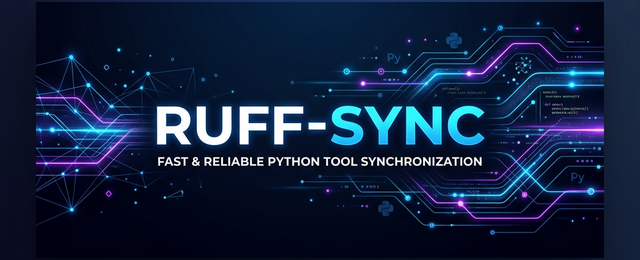

# ruff-sync

<div class="badges" style="display: flex; gap: 5px; margin-bottom: 20px;">
  <a href="https://pypi.org/project/ruff-sync/"></a>
  <a href="https://pypi.org/project/ruff-sync/"></a>
  <a href="https://github.com/Kilo59/ruff-sync/blob/main/LICENSE"></a>
</div>

**ruff-sync** is a lightweight CLI tool to synchronize [Ruff](https://docs.astral.sh/ruff/) linter configuration across multiple Python projects.

## 🚀 Key Features

* **⚡ Fast & Lightweight**: Zero-config needed for most projects.
* **✨ Formatting Preserved**: Uses `tomlkit` to keep your comments, indentation, and whitespace exactly as they are.
* **🛡️ Smart Merging**: Safely merges nested tables (like `lint.per-file-ignores`) without overwriting local overrides.
* **📂 Upstream Layers**: Combine and merge configurations from several sources sequentially.
* **🔗 Flexible Sources**: Sync from GitHub, GitLab, raw URLs, or local files.
* **✅ CI Ready**: Built-in `check` command with semantic diffs for automated pipelines.

---

## 🧐 The Problem

Maintaining a consistent Ruff configuration across 10, 50, or 100 repositories is painful. When you decide to adopt a new rule or change a setting, you have to manually update every single `pyproject.toml`.

Internal "base" configurations or shared presets often fall out of sync, or require complex inheritance setups that are hard to debug or don't support modern TOML features.

## 💡 The Solution

`ruff-sync` lets you define a "source of truth" (a URL to a `pyproject.toml` or `ruff.toml`) and pull the `[tool.ruff]` section into your local projects with a single command.

!!! tip "Zero Drift"
    Use `ruff-sync check` in your CI to guarantee that no repository ever drifts from your organization's standards.

---

## 🏁 Quick Start

### 1. Configure your project

Add the upstream URL to your `pyproject.toml`:

```toml
[tool.ruff-sync]
upstream = "https://github.com/my-org/standards/blob/main/pyproject.toml"
```

### 2. Pull the configuration

```bash
uv run ruff-sync pull
```

This will download the upstream file, extract the `[tool.ruff]` section, and merge it into your local file while **preserving your artisanal comments and formatting**.
