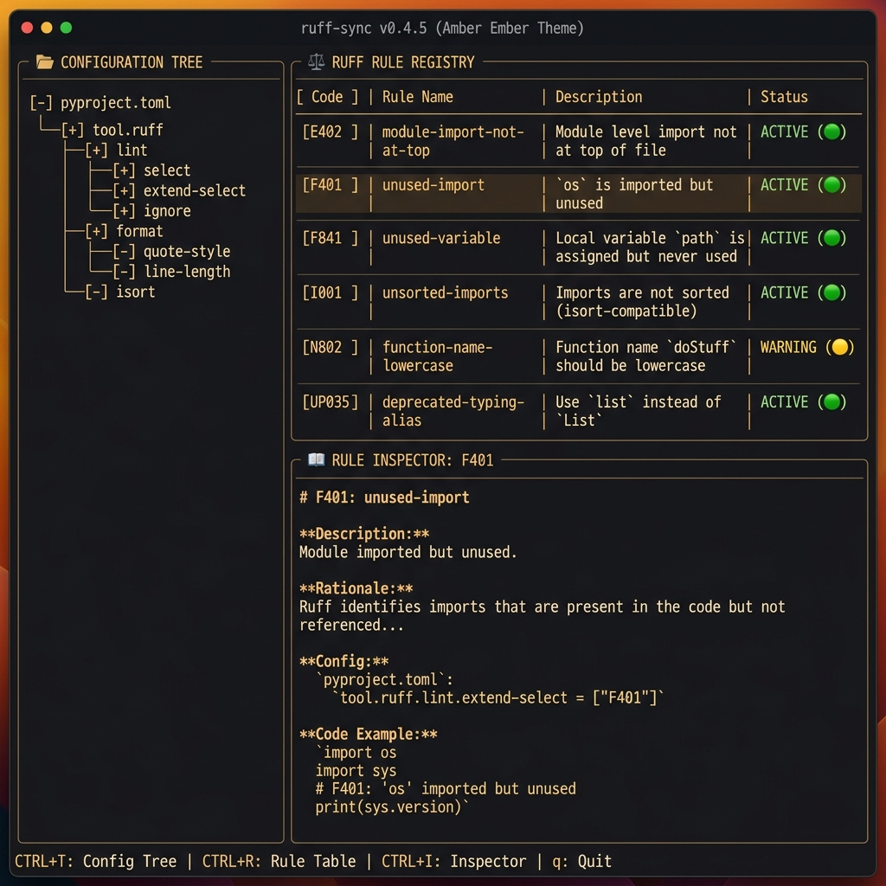
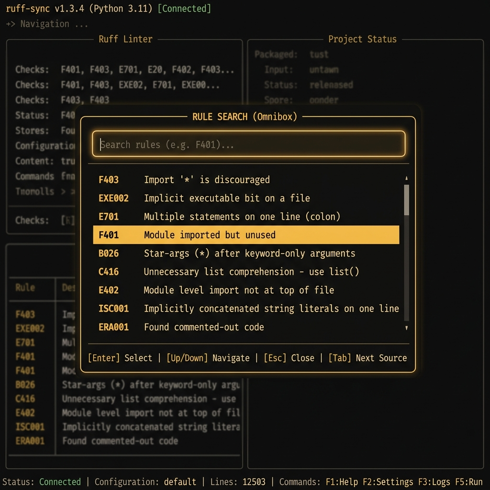

# Ruff Config Inspection

`ruff-sync` includes an experimental Terminal User Interface (TUI) for exploring and interrogating your project's Ruff configuration.

!!! danger "Experimental Feature"
    The Ruff Config Inspection TUI is currently **experimental**. It may undergo rapid architectural changes, be refactored, or be removed entirely in upcoming versions. Use with the understanding that the interface and behavior are not yet stable.

---

## 📸 Overview

The Ruff Config Inspection TUI provides a structured, interactive view of your `tool.ruff` configuration, allowing you to browse effective rules, search the full Ruff rule registry, and view detailed documentation for any rule or configuration key.


*The main TUI view showing the configuration tree, rule registry, and detailed inspector.*

---

## 🚀 Getting Started

### Installation

The TUI components are optional to keep the base `ruff-sync` package lightweight. To use the inspection features, install `ruff-sync` with the `tui` extra.

#### ⚡ Recommended: Using `uv`

##### Persistent Tool Installation

The easiest way to use the TUI across all your projects is by installing `ruff-sync` with the `tui` extra as a [uv tool](https://docs.astral.sh/uv/guides/tools/):

```bash
uv tool install "ruff-sync[tui]"
# Then simply run:
ruff-inspect
```

##### One-off Invocation

If you just want to run the TUI once without a permanent installation, use `uvx`:

```bash
uvx --with "ruff-sync[tui]" ruff-sync inspect
```

##### Project-specific Development

To use the TUI within a specific project, add it to your development dependencies:

```bash
uv add --dev "ruff-sync[tui]"
# Then run it with:
uv run ruff-inspect
```

---

#### 🛠️ Other Installation Methods

=== "pipx"

    [pipx](https://github.com/pypa/pipx) is the recommended way to install Python CLIs globally in isolated environments.

    ```bash
    pipx install "ruff-sync[tui]"
    ```

=== "pip"

    You can install the TUI from PyPI using `pip`:

    ```bash
    pip install "ruff-sync[tui]"
    ```

    > [!WARNING]
    > We recommend using a virtual environment or `pipx` to avoid dependency conflicts with other global packages.

### Usage

You can launch the TUI using either the `inspect` subcommand or the dedicated `ruff-inspect` entry point:

=== "Subcommand"

    ```bash
    ruff-sync inspect
    ```

=== "Direct Entry Point"

    ```bash
    ruff-inspect
    ```

If you are working in a specific directory or want to point to a different `pyproject.toml`, use the `--to` flag:

```bash
ruff-inspect --to path/to/project
```

---

## ✨ Key Features

### 🌳 Configuration Tree
The left sidebar provides a hierarchical view of your local Ruff configuration. Selecting a node (like `lint` or `format`) filters the rule registry to show only relevant settings and rules.

### 🔍 Rule Registry & Inspector
The upper-right table displays the rules currently effective in your project. Each rule shows its code, name, and status (e.g., explicitly enabled via `select` or ignored).

When you select a rule, the **Rule Inspector** at the bottom-right fetches and displays the full documentation for that rule, including its rationale and code examples.

### ⚡ Global Rule Search (Omnibox)
Press `/` at any time to open the **Omnibox**. This allows you to perform a fuzzy search across the entire Ruff rule registry, even for rules not currently active in your project.


*The Omnibox search interface for quick rule discovery.*

---

## ⌨️ Keyboard Shortcuts

| Key | Action |
| :--- | :--- |
| `q` | **Quit** the application. |
| `/` | Open the **Global Search** (Omnibox). |
| `?` or `l` | Show the **Legend** / Help modal. |
| `c` | **Copy** the current inspector content to the clipboard. |
| `Enter` | Select a node or rule to inspect. |
| `Tab` | Move focus between the tree, table, and inspector. |
| `Esc` | Close the current modal or search. |
