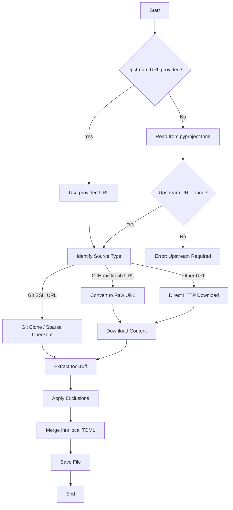

# Usage

`ruff-sync` provides two main commands: `pull` and `check`.

## Commands

### `pull`

The `pull` command downloads the upstream configuration and merges it into your local file.

```bash
ruff-sync pull [UPSTREAM_URL] [--to PATH] [--exclude KEY...]
```

If `UPSTREAM_URL` is omitted, it must be defined in your `pyproject.toml` under `[tool.ruff-sync]`.

### `check`

The `check` command verifies if your local configuration matches the upstream one. It is ideal for CI pipelines.

```bash
ruff-sync check [UPSTREAM_URL] [--semantic] [--diff]
```

- `--semantic`: Ignore "non-functional" differences like whitespace, comments, or key order.
- `--diff`: Show a unified diff of the differences (enabled by default).

## Logic Flow

The following diagram illustrates how `ruff-sync` handles the synchronization process:



## URL Support

`ruff-sync` supports a wide variety of URL types:

| Type | Example |
| :--- | :--- |
| **GitHub Blob** | `https://github.com/org/repo/blob/main/pyproject.toml` |
| **GitHub Repo** | `https://github.com/org/repo` (defaults to `pyproject.toml`) |
| **GitLab Blob** | `https://gitlab.com/org/repo/-/blob/main/pyproject.toml` |
| **Raw Content** | `https://raw.githubusercontent.com/.../pyproject.toml` |
| **Git (SSH)** | `git@github.com:org/repo.git` |
| **Local File** | `../another-project/pyproject.toml` |

## Initializing a Project

If you are starting a new project and don't have a `pyproject.toml` yet, you can use the `--init` flag:

```bash
ruff-sync pull https://github.com/my-org/standards --init
```

This will create a `pyproject.toml` with the upstream configuration and add the `[tool.ruff-sync]` section for you.
