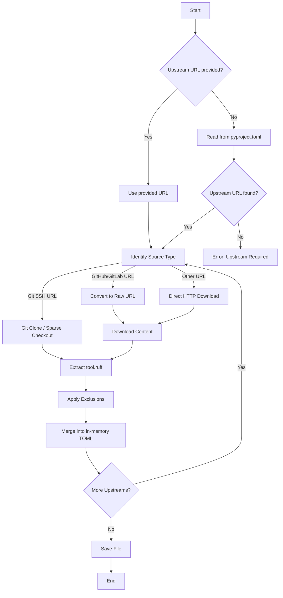

# Usage

`ruff-sync` provides two main commands: `pull` and `check`.

## Commands

### `pull`

The `pull` command downloads the upstream configuration and merges it into your local file.

```bash
ruff-sync pull [UPSTREAM_URL...] [--to PATH] [--exclude KEY...] [--init]
```

- **`UPSTREAM_URL...`**: One or more URLs to the source `pyproject.toml` or `ruff.toml`. Optional if defined in your local config.
- **`--to`**: Where to save the merged config (defaults to `.`).
- **`--exclude`**: Dotted paths of keys to keep local (e.g., `lint.isort`).
- **`--init`**: Create a new `pyproject.toml` if it doesn't exist.

### `check`

The `check` command verifies if your local configuration matches the upstream one.

```bash
ruff-sync check [UPSTREAM_URL...] [--semantic] [--diff]
```

- **`--semantic`**: Ignore "non-functional" differences like whitespace, comments, or key order.
- **`--diff` / `--no-diff`**: Control the display of the unified diff.

---

## ✨ Artisanal Merging

One of the core features of `ruff-sync` is its ability to respect your file's existing structure.

Unlike other tools that might rewrite your TOML and strip away comments or change indentation, `ruff-sync` uses `tomlkit` to perform a **lossless merge**.

!!! info "What is preserved?"
_ **Comments**: All comments in your local file are kept.
_ **Whitespace**: Your indentation and line breaks are respected. \* **Key Order**: The order of your existing keys in `[tool.ruff]` is preserved where possible.

---

## 🛠️ Advanced Usage

### Syncing from a subdirectory

If your upstream repository has multiple configurations, you can specify a `--path`:

```bash
ruff-sync pull https://github.com/my-org/standards --path configs/backend
```

### Excluding specific rules

If you want to follow most upstream rules but have a few exceptions:

```bash
ruff-sync pull --exclude lint.ignore lint.select
```

### Initializing a new project

```bash
ruff-sync pull https://github.com/my-org/standards --init
```

This will create a `pyproject.toml` with the upstream configuration and add the `[tool.ruff-sync]` section so subsequent runs only need `ruff-sync pull`.

---

## 🗺️ Logic Flow

The following diagram illustrates how `ruff-sync` handles the synchronization process:


