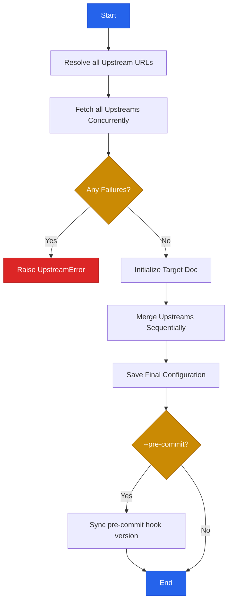
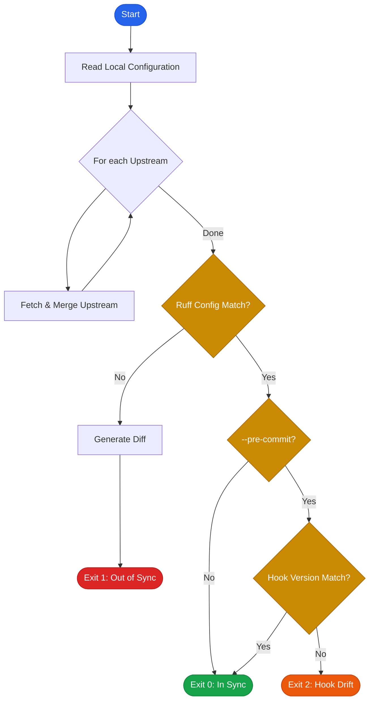

# Usage

`ruff-sync` provides two main commands—`pull` and `check`—designed to keep your Ruff configuration synchronized across projects.

This guide covers common daily workflows, explains how `ruff-sync` merges configuration, and provides a full command reference.

> [!TIP]
> Looking for organization-wide setup advice? Check out our [Best Practices](best-practices.md) guide.

---

## 🌟 Common Workflows

### The Basic Sync

If you want to pull rules from a central repository into your current project, run:

```bash
ruff-sync https://github.com/my-org/standards
```

This fetches the `pyproject.toml` from the `main` branch of `my-org/standards`, extracts the `[tool.ruff]` section, and surgically merges it into your local `pyproject.toml`.

### Persistent Configuration

Instead of passing the URL every time, you can save the upstream URL in your project's `pyproject.toml`:

```toml
[tool.ruff-sync]
upstream = "https://github.com/my-org/standards"
```

Now, you can simply run:

```bash
ruff-sync
```

### Layer-Based Configuration

You can specify multiple upstreams to create a layered configuration. `ruff-sync` will merge them sequentially, allowing you to combine a base organization standard with team-specific overrides:

```bash
ruff-sync https://github.com/my-org/standards https://github.com/my-org/team-tweaks
```

Alternatively, configure this in your `pyproject.toml`:

```toml
[tool.ruff-sync]
upstream = [
    "https://github.com/my-org/standards",
    "https://github.com/my-org/team-tweaks"
]
```

### Initializing a New Project

If your local directory doesn't have a `pyproject.toml` yet, you can scaffold one:

```bash
ruff-sync https://github.com/my-org/standards --init
```

This creates a new `pyproject.toml` populated with the upstream configuration and automatically adds a `[tool.ruff-sync]` block so you won't need to specify the URL again.

### Syncing Subdirectories

If the upstream repository stores its Python configuration in a specific subdirectory or you want to point to a specific file, use the `--path` argument.

=== "Subdirectory"

    Point to a specific subdirectory, such as a `backend/` folder in a monorepo.

    ```bash
    ruff-sync https://github.com/my-org/standards --path backend
    ```

=== "Nested Path"

    Point to a more deeply nested directory.

    ```bash
    ruff-sync https://github.com/my-org/standards --path configs/standards/python/backend
    ```

=== "Specific `pyproject.toml`"

    Directly target a `pyproject.toml` file to bypass the default configuration searching logic.

    ```bash
    ruff-sync https://github.com/my-org/standards --path backend/pyproject.toml
    ```

=== "Specific `ruff.toml`"

    Directly target a specific `ruff.toml` or `.ruff.toml` file to ensure a deterministic source and avoid searching.

    ```bash
    ruff-sync https://github.com/my-org/standards --path tools/ruff.toml
    ```

See the [Pre-defined Configs](pre-defined-configs.md#fastapi-async) page for a real-world example of using the `--path` option, or the [URL Resolution Guide](url-resolution.md) for details on how different paths are resolved.

### Excluding Specific Rules

Sometimes your project needs to deviate slightly from the upstream standard. You can exclude specific dotted paths to preserve your local settings:

```bash
ruff-sync --exclude lint.ignore lint.select
```

*(By default, `lint.per-file-ignores` is always excluded so your local file-specific ignores are safe).*

---

## 🔍 Checking for Drift

To ensure your repository hasn't drifted from your organization's unified standards, use the `check` command. It compares your local config to the upstream and warns you of any divergence.

```bash
ruff-sync check https://github.com/my-org/standards
```

*(If you have `upstream` configured in your `pyproject.toml`, you can just run `ruff-sync check`.)*

### Semantic Checking

Often, the exact ordering of keys, whitespace, or comments might slightly differ from the upstream, even though the actual rules are identical. Use the `--semantic` flag to ignore functional equivalents:

```bash
ruff-sync check --semantic
```

*(This is heavily recommended for CI pipelines.)*

---

## ✨ Artisanal Merging

One of the core features of `ruff-sync` is its ability to respect your file's existing structure.

Unlike other tools that might blindly overwrite your file, strip away comments, or change indentation, `ruff-sync` uses `tomlkit` to perform a **lossless merge**.

!!! info "What is preserved?"
    *   **Comments**: All comments in your local file are kept exactly where they are.
    *   **Whitespace**: Your indentation and line breaks are respected.
    *   **Key Order**: The order of your existing keys in `[tool.ruff]` is preserved where possible.
    *   **Non-Ruff Configs**: Any other sections in your `pyproject.toml` (like `[project]` or `[tool.pytest]`) are completely untouched.

---

## 📚 Command Reference

### `pull` (or just `ruff-sync`)

Downloads the upstream configuration and merges it into your local file. Note that `pull` is the default command, so `ruff-sync` and `ruff-sync pull` are functionally identical and can be used interchangeably.

```bash
ruff-sync [UPSTREAM_URL...] [--to PATH] [--exclude KEY...] [--init] [--pre-commit]
```

* **`UPSTREAM_URL...`**: One or more URLs to the source `pyproject.toml` or `ruff.toml`. Optional if defined in your local `[tool.ruff-sync]` config. Multiple URLs form a fallback/merge chain. All upstreams are fetched **concurrently**, but they are merged sequentially in the order they are defined. If any upstream fails to fetch, the entire operation will fail.
* **`--to PATH`**: Where to save the merged config (defaults to the current directory `.`).
* **`--exclude KEY...`**: Dotted paths of keys to keep local and never overwrite (e.g., `lint.isort`).
* **`--init`**: Create a new `pyproject.toml` with the upstream configuration if it doesn't already exist. This automatically saves the upstream source and any other CLI flags into the `[tool.ruff-sync]` section.
* **`--save` / `--no-save`**: Force serialization (or prevent serialization) of the provided CLI arguments (like `upstream`, `exclude`, etc.) directly into the `[tool.ruff-sync]` section of the target `pyproject.toml` for future use. Note: any credentials present in the upstream URL will cause this operation to safely abort.
* **`--pre-commit`**: Sync the `astral-sh/ruff-pre-commit` hook version inside `.pre-commit-config.yaml` with the project's Ruff version.

### `check`

Verifies if your local configuration matches what the upstream would produce. It exits with a non-zero code if differences are found:

* Exit **`0`**: Configuration is fully in sync.
* Exit **`1`**: `pyproject.toml` or `ruff.toml` drifted from the upstream.
* Exit **`2`**: Local config is in sync, but the `.pre-commit-config.yaml` hook drifted from the project's Ruff version (only applies if `--pre-commit` is enabled).

```bash
ruff-sync check [UPSTREAM_URL...] [--semantic] [--diff] [--pre-commit]
```

* **`UPSTREAM_URL...`**: The source URL(s). Optional if defined locally.
* **`--semantic`**: Ignore "non-functional" differences like whitespace, comments, or key order. Only errors if the actual Python-level data differs.
* **`--diff` / `--no-diff`**: Control the display of the unified diff in the terminal.
* **`--pre-commit`**: Verify that the `astral-sh/ruff-pre-commit` hook version matches the project's Ruff version in addition to checking configuration drift. If you have `pre-commit-version-sync = true` configured in your `pyproject.toml`, the `check` command will automatically respect this setting and you do not need to pass this flag.

---

## 🗺️ Logic Flow

### Pull Logic

The following diagram illustrates how `ruff-sync` handles the `pull` synchronization process under the hood:



### Check Logic

When you run `ruff-sync check`, it follows this process to determine if your project has drifted from the upstream source:


