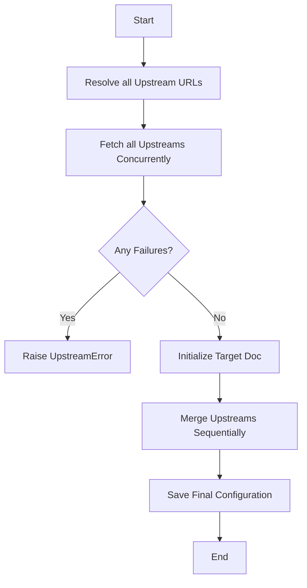

# Usage

`ruff-sync` provides two main commands—`pull` and `check`—designed to keep your Ruff configuration synchronized across projects.

This guide covers common daily workflows, explains how `ruff-sync` merges configuration, and provides a full command reference.

---

## 🌟 Common Workflows

### The Basic Sync

If you want to pull rules from a central repository into your current project, run:

```bash
ruff-sync pull https://github.com/my-org/standards
```

This fetches the `pyproject.toml` from the `main` branch of `my-org/standards`, extracts the `[tool.ruff]` section, and surgically merges it into your local `pyproject.toml`.

### Persistent Configuration

Instead of passing the URL every time, you can save the upstream URL in your project's `pyproject.toml`:

```toml
[tool.ruff-sync]
upstream = "https://github.com/my-org/standards"
```

Now, you can simply run:

```bash
ruff-sync pull
```

### Initializing a New Project

If your local directory doesn't have a `pyproject.toml` yet, you can scaffold one:

```bash
ruff-sync pull https://github.com/my-org/standards --init
```

This creates a new `pyproject.toml` populated with the upstream configuration and automatically adds a `[tool.ruff-sync]` block so you won't need to specify the URL again.

### Syncing Subdirectories

If the upstream repository stores its Python configuration in a specific subdirectory (like a `backend/` folder in a monorepo), use the `--path` argument:

```bash
ruff-sync pull https://github.com/my-org/standards --path backend
```

### Excluding Specific Rules

Sometimes your project needs to deviate slightly from the upstream standard. You can exclude specific dotted paths to preserve your local settings:

```bash
ruff-sync pull --exclude lint.ignore lint.select
```

*(By default, `lint.per-file-ignores` is always excluded so your local file-specific ignores are safe).*

---

## 🔍 Checking for Drift

To ensure your repository hasn't drifted from your organization's unified standards, use the `check` command. It compares your local config to the upstream and warns you of any divergence.

```bash
ruff-sync check https://github.com/my-org/standards
```

*(If you have `upstream` configured in your `pyproject.toml`, you can just run `ruff-sync check`.)*

### Semantic Checking

Often, the exact ordering of keys, whitespace, or comments might slightly differ from the upstream, even though the actual rules are identical. Use the `--semantic` flag to ignore functional equivalents:

```bash
ruff-sync check --semantic
```

*(This is heavily recommended for CI pipelines.)*

---

## ✨ Artisanal Merging

One of the core features of `ruff-sync` is its ability to respect your file's existing structure.

Unlike other tools that might blindly overwrite your file, strip away comments, or change indentation, `ruff-sync` uses `tomlkit` to perform a **lossless merge**.

!!! info "What is preserved?"
    *   **Comments**: All comments in your local file are kept exactly where they are.
    *   **Whitespace**: Your indentation and line breaks are respected.
    *   **Key Order**: The order of your existing keys in `[tool.ruff]` is preserved where possible.
    *   **Non-Ruff Configs**: Any other sections in your `pyproject.toml` (like `[project]` or `[tool.pytest]`) are completely untouched.

---

## 📚 Command Reference

### `pull`

Downloads the upstream configuration and merges it into your local file.

```bash
ruff-sync pull [UPSTREAM_URL...] [--to PATH] [--exclude KEY...] [--init]
```

* **`UPSTREAM_URL...`**: One or more URLs to the source `pyproject.toml` or `ruff.toml`. Optional if defined in your local `[tool.ruff-sync]` config. Multiple URLs form a fallback/merge chain. All upstreams are fetched **concurrently**, but they are merged sequentially in the order they are defined. If any upstream fails to fetch, the entire operation will fail.
* **`--to PATH`**: Where to save the merged config (defaults to the current directory `.`).
* **`--exclude KEY...`**: Dotted paths of keys to keep local and never overwrite (e.g., `lint.isort`).
* **`--init`**: Create a new `pyproject.toml` with the upstream configuration if it doesn't already exist.

### `check`

Verifies if your local configuration matches what the upstream would produce. It exits with a non-zero code if differences are found.

```bash
ruff-sync check [UPSTREAM_URL...] [--semantic] [--diff]
```

* **`UPSTREAM_URL...`**: The source URL(s). Optional if defined locally.
* **`--semantic`**: Ignore "non-functional" differences like whitespace, comments, or key order. Only errors if the actual Python-level data differs.
* **`--diff` / `--no-diff`**: Control the display of the unified diff in the terminal.

---

## 🗺️ Logic Flow

The following diagram illustrates how `ruff-sync` handles the synchronization process under the hood:


